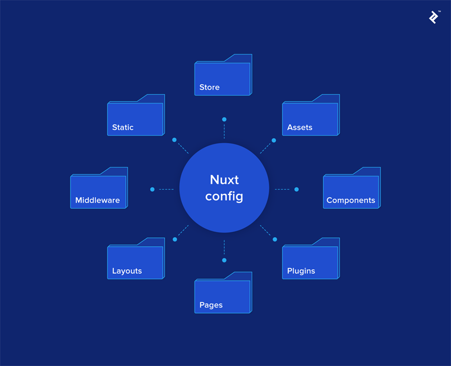

# nuxt, (typescript X), eslint, 블로그(Vue 2.0, Nuxt 2)
## 프로젝트 구성 순서 및 설치 내용.
*  프로젝트 폴더 생성.
* npm init
* .gitignore 파일 생성하여 제외목록 작성.
  - ignore 해야할 목록을 알려주는 사이트 [https://www.gitignore.io/](https://www.gitignore.io/)
* github에 repository 생성하여 현재 폴더를 git remote 시킴.
  - git init
  - git add .
  - git commit -m '첫 프로젝트 생성'
  - git remote add origin https://github.com/redsky0212/nuxt_redsky_blog.git
* nuxt설치의 다양한 방법
  - npx로 설치(npx create-nuxt-app <프로젝트명>)
  - vue-cli로설치
    - cli설치 npm i -g @vue/cli @vue/cli-init
    - vue init nuxt-community/express-template 프로젝트명
    - cd 프로젝트명
    - npm i
  - offline 설치
    - git clone https://github.com/nuxt-community/starter-template 에서 미리 클론 받아서 프로젝트 폴더로 옮겨놓는다.
    - 이 상태에서 vue cli로 오프라인 설치를 한다. vue init starter-template 프로젝트명 --offline
  - Nuxt.js 단일설치 (npm i nuxt)
* nuxt 단일 설치 (```Vue2, Vue Router, Vuex, Vue Server Renderer, vue-meta, vue-loader, babel-loader, webpack 포함됨```)
  - npm i nuxt
    - vue가이드 사이트 : [https://kr.vuejs.org/v2/guide/index.html](https://kr.vuejs.org/v2/guide/index.html)
    - nuxt가이드 사이트 : [https://ko.nuxtjs.org/guide](https://ko.nuxtjs.org/guide)
    - [nuxt 가이드북 (https://vue-nuxt.gitbook.io/nuxt/)](https://vue-nuxt.gitbook.io/nuxt/)
* package.json, ```'scripts'``` 작성
  ```javascript
  {
    "scripts": {
      "dev": "nuxt",
      "build": "nuxt build",
      "start": "nuxt start"
    }
  }
  ```
  - nuxt에서 제공하는 커맨드 명령어
    - nuxt : 개발서버를 구동([HMR(hot module replacement)](https://webpack.js.org/concepts/hot-module-replacement/) 기능 활성화)
      - npm run dev로 실행, .nuxt/폴더에 빌드결과생성
    - nuxt build : 배포목적 빌드(css, js압축 등)
    - nuxt start : 배포모드로 서버구동(빌드 후에 사용)
    - nuxt generate : 정적호스팅목적으로 앱 빌드(모든 라우트 html파일생성)
      - npm run generate로 실행, dist/폴더에 빌드결과생성
    - ```(참조) 빌드결과 위치를 수정하고자 할때는 nuxt.config.js 에서 buildDir로 설정할 수 있다.```

* pages 폴더를 생성.
  - index.vue 파일 생성 (첫 entry페이지)
  - 나머지 필요파일 생성

* nuxt 환경설정 (nuxt.config.js)
  - 
  - [NUXTCONFIG.md 파일 참조.](https://github.com/redsky0212/nuxt_redsky_blog/blob/master/NUXTCONFIG.md)

* client 폴더 하나로 정리하기
  - 루트에 client폴더를 만든다 ```mkdir client```
  - nuxt.config.js에 srcDir옵션을 설정하여 만든 client폴더를 설정해 준다.
  - client폴더에 pages, assets 등 폴더를 이동한다.

* Pug, Sass 사용
  - Pug설치 : npm i -D pug pug-plain-loader (특별히 사용할 필요는 없는것 같음.)
  - Sass설치 : npm i -D node-sass sass-loader (잘 사용하면 유용함.)
    - 설치 후 ```lang="scss"``` 셋팅하고 사용. sass보다 scss 사용하는게 더 좋음.

* style 사용 방법
  - global스타일
    - nuxt.config.js에 css: ['@/assets/sass/main.scss'] 설정 후 사용.
  - local스타일
    - 각 SPA 화면에 &lt;style lang="scss" ```scoped```&gt; 설정 후 각 페이지에서 사용.

* Typescript 사용
  - 경우에따라 typescript를 사용할 수 있다.

* ESLint, Prettier 사용
  - ESLint : 코드를 깔끔하게 유지.
  - Prettier : 코드 포매터.
  - 설치 : ```npm i -D babel-eslint eslint eslint-config-prettier eslint-loader eslint-plugin-vue eslint-plugin-prettier prettier```
  - .eslintrc.js 파일 생성 ```touch .eslintrc.js``` eslint관련 설정을 코딩한다.
  - package.json의 "scripts"에 lint, lintfix 스크립트를 추가해서 lint를 실행 할 수 있게 적용한다.
  ```javascript
  "scripts": {
    "dev": "nuxt",
    "build": "nuxt build",
    "start": "nuxt start",
    "lint": "eslint --ext .js,.vue --ignore-path .gitignore .",
    "lintfix": "eslint --fix --ext .js,.vue --ignore-path .gitignore ."
  },
  ```

* ESLint 를 webpack을 통해 핫 리로드 모드 활성화 하기. (npm run dev 실행동안 저장시 lint를 확인한다.)
  - nuxt.config.js에 다음 소스 추가.
  ```javascript
  ...
  /*
   ** Build configuration
  */
  build: {
   /*
    ** You can extend webpack config here
   */
   extend(config, ctx) {
      // Run ESLint on save
      if (ctx.isDev && ctx.isClient) {
        config.module.rules.push({
          enforce: "pre",
          test: /\.(js|vue)$/,
          loader: "eslint-loader",
          exclude: /(node_modules)/
        })
      }
    }
  }
  ```
  - [ESLint설정관련 참조 url](https://velog.io/@kyusung/eslint-config-2)
  - .eslintrc.js파일에서 lint관련 추가,빼기를 적용하여 적절하게 lint를 적용한다.

* IE 호환 설정
  - IE브라우저 호환을 위한 설정